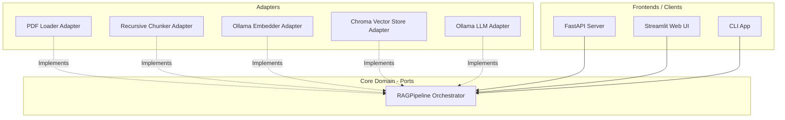

# Open Source LLM Experiments & RAG Chatbot

Run local Large Language Model (LLM) experiments with [Ollama](https://ollama.com) and Python. This project covers everything from interactive Jupyter Notebooks and prompt engineering to a decoupled, production-grade PDF-based RAG (Retrieval-Augmented Generation) application featuring a **FastAPI API**, a **Streamlit Web UI**, and a **CLI interface** powered by [Chroma](https://www.trychroma.com/).

---

## Architecture

This project is built using **Domain-Driven Design (DDD)** and the **Ports-and-Adapters (Hexagonal) architecture**. The core RAG orchestration logic is fully decoupled from external libraries, frameworks, and infrastructure:



- **Core Domain (`src/pipeline/`)**: Defines abstract ports and orchestrates the ingestion and querying flow without knowing how loading, chunking, embedding, vector storing, or LLM querying are concretely implemented.
- **Adapters**: Swappable plugins that implement the interfaces defined by the core domain:
  - `src/loader/`: Document parsing (e.g., PyPDF adapter).
  - `src/chunker/`: Splits document text (e.g., recursive character splitter adapter).
  - `src/embedder/`: Generates text embeddings (e.g., Ollama adapter).
  - `src/vector_store/`: Persists and queries embeddings (e.g., Chroma adapter).
  - `src/llm/`: Interfaces with the language model (e.g., Ollama adapter).

---

## Project Structure

```
├── .gitignore
├── README.md
├── pyproject.toml
├── uv.lock
├── LICENSE
├── .env.example
├── notebooks/
│   ├── 01_first_ollama.ipynb
│   └── 02_prompt_engineering.ipynb
├── src/
│   ├── app.py                  # FastAPI server (basic Ollama chat endpoint)
│   ├── rag_streamlite.py       # Streamlit Web UI for PDF RAG
│   ├── rag_app.py              # CLI interactive chat application
│   ├── rag_chatbot.py          # Composition root / legacy compatibility API
│   ├── pipeline/               # Core domain interfaces & RAG pipeline orchestrator
│   ├── loader/                 # Document loading interfaces & concrete adapters
│   ├── chunker/                # Text splitting interfaces & concrete adapters
│   ├── embedder/               # Embedding interfaces & concrete adapters
│   ├── vector_store/           # Vector store interfaces & concrete adapters
│   └── llm/                    # LLM interfaces & concrete adapters
├── data/
│   └── iso27001.pdf            # Place your PDF documents here (git-ignored)
├── chroma_db/                  # Local vector database store (git-ignored)
├── docs/
│   └── notes.md
└── tests/
    └── test_basic.py
```

---

## Requirements

- [Ollama](https://ollama.com/download)
- [uv](https://docs.astral.sh/uv/)
- Python 3.10+

---

## Setup

### 1. Install Ollama

Download and install from [ollama.com/download](https://ollama.com/download), then verify it is running:
```bash
ollama --version
```

### 2. Pull Required Models

This project uses a chat/LLM model and an embedding model. Pull them using:
```bash
ollama pull llama3.2:1b
ollama pull nomic-embed-text
```

#### Recommended Chat Models (Light to Heavy)

| Model | Size | Notes |
|-------|------|-------|
| `llama3.2:1b` | ~1.3 GB | Default for this repo (extremely fast) |
| `gemma2:2b` | ~1.6 GB | Google's lightweight model |
| `qwen2.5:3b` | ~1.9 GB | Excellent multilingual support |
| `llama3.1:8b` | ~4.7 GB | High capability |
| `mistral:7b` | ~4.1 GB | Popular general-purpose model |

### 3. Python Environment Setup

We use `uv` for lightning-fast Python package management:
```bash
# Install uv (if not already installed)
curl -LsSf https://astral.sh/uv/install.sh | sh

# Synchronize dependencies and create virtual environment
uv sync

# Configure environment variables
cp .env.example .env
```

`uv sync` will create a local `.venv` directory and install all required dependencies (including FastAPI, Streamlit, and development tools like pytest).

### 4. Add a PDF Document

Place a PDF document at `data/iso27001.pdf` (or edit `PDF_PATH` in your `.env` file). The RAG pipeline will load, parse, and index this document on startup.

---

## Configuration

Adjust settings inside your `.env` file:

| Variable | Default | Description |
|----------|---------|-------------|
| `OLLAMA_HOST` | `http://localhost:11434` | Ollama API endpoint |
| `OLLAMA_MODEL` | `llama3.2:1b` | LLM model for responding |
| `OLLAMA_EMBEDDING_MODEL` | `nomic-embed-text` | Embedding model for semantic search |

---

## Running the Applications

Always ensure Ollama is running (`ollama serve` or open the Ollama desktop app) before launching the following:

### 📱 1. Streamlit Web UI (RAG Chatbot)
Start the interactive Web UI to chat with your PDF document:
```bash
PYTHONPATH=src uv run streamlit run src/rag_streamlite.py
```

### 🔌 2. FastAPI Server
Run the FastAPI web server hosting the basic chat API:
```bash
uv run uvicorn src.app:app --host 0.0.0.0 --port 8000
```
*You can test the health endpoint at `http://localhost:8000/health` or access `/docs` for interactive Swagger API documentation.*

### 💻 3. CLI Chatbot (RAG Chatbot)
Start an interactive CLI question-answering session inside the terminal:
```bash
PYTHONPATH=src uv run python src/rag_app.py
```

### 📓 4. Jupyter Notebooks
Run the development and exploration notebooks:
```bash
uv run jupyter notebook notebooks/
```

### 🧪 5. Run Tests
Execute the unit tests:
```bash
uv run pytest
```

---

## Dependency Management

To add or manage packages, use `uv` directly:

- **Add a runtime package:**
  ```bash
  uv add <package-name>
  ```
- **Add a development package:**
  ```bash
  uv add --dev <package-name>
  ```

---

## Troubleshooting

| Issue | Cause & Fix |
|-------|-------------|
| **Connection Refused** | Ollama is not running. Start it via `ollama serve` or by opening the Ollama application. |
| **Model Not Found** | Pull the model first: `ollama pull llama3.2:1b` (or whichever model you configured). |
| **PDF Not Found** | Ensure your target document exists at `data/iso27001.pdf` or check the `PDF_PATH` env var. |
| **`ModuleNotFoundError`** | Run `uv sync` to ensure dependencies are installed. When running RAG apps, ensure `PYTHONPATH=src` is set so Python can resolve the internal sub-modules. |
| **Slow Ingestion** | The first run indexes and embeds the entire document. Subsequent runs reuse the persisted `chroma_db/` cache. |
